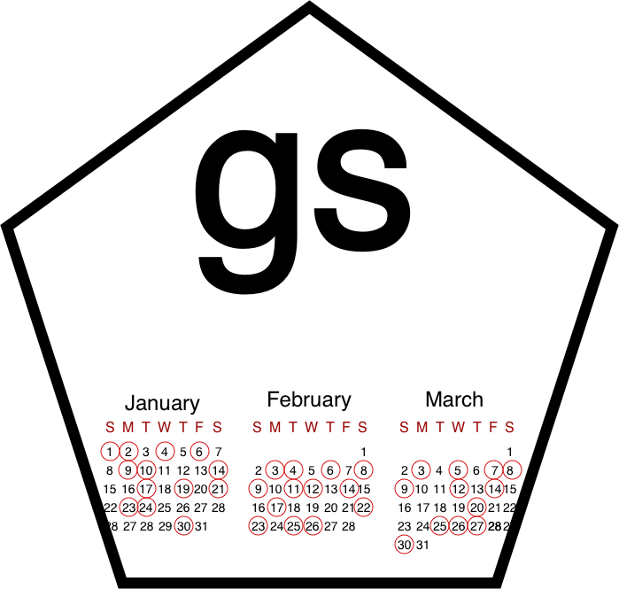

class: left, top

```{r setup, include=FALSE}
options(htmltools.dir.version = FALSE)
library(kableExtra)
```

# Introducing `{gs}`

### A grammar of recurring calendar events
.pull-left[
##### James Laird-Smith  
##### EARL Conference  
##### 12 September 2019
]

.bottom-left-img[

```{r echo=FALSE,  out.width="100%"}

```

]
.pull-right[
```{r echo=FALSE, fig.pos="r", out.width="100%"}

```
]

---
layout: true
class: animated, fadeIn

---
class: large, one-quarter-spaced, one-half-para-break

.top-right-img[
```{r echo=FALSE, fig.pos="r", out.width="100%"}

```
]

# Why `{gs}`?

--

- R already has tools for dates and times.  

  - Eg. `base`, `lubridate` etc.
  - These can create evenly spaced events.
  
--

- R has few tools for schedules **when the event pattern is irregular**.
  
  - Eg. Summer Bank Holiday (last Monday in August)
  - Easter
  - Strange bespoke examples.
  
- Often important (like financial contracts).
---
class: large, one-quarter-spaced, one-half-para-break

.top-right-img[
```{r echo=FALSE, fig.pos="r", out.width="100%"}

```
]

.double-para-break[
# What is `{gs}`?
]

--

* **An R package** for recurring calendar events (schedules). 

--

* Functions for:  

  + Creating schedules.
  + Composing schedules.
  + Working with schedules.
  + (The whole schedule lifecycle.)

--

* **A grammar**
 + Solve your own problems.

---
class: large, one-quarter-spaced, one-half-para-break

.top-right-img[
```{r echo=FALSE, fig.pos="r", out.width="100%"}

```
]

.double-para-break[
# What can `{gs}` do?
]

- Simple schedules

--

- Holiday shortcuts (i.e. Easter)

--

- Nth (last) occurrence in a period (eg. Bank holidays)

--
  
- Directional schedules
  - Eg. after US Thanksgiving but before Black Friday

--
  
- Incremental schedules
  - Eg. every 5 business days
  
--
  
- Forthcoming
  - More holidays (in their own package)
  - Rolling dates

---
class: large, one-quarter-spaced, one-half-para-break

.top-right-img[
```{r echo=FALSE, fig.pos="r", out.width="100%"}

```
]

# A introductory example

```{r}
library(gs)
library(magrittr)
```

- How would you schedule New Year's Day?

--

- What is special about New Year's Day?

  - The first day of the year.
  
--

**`on_yday()`** is a dedicated function to make a schedule of events occurring on
certain days of the year.

```{r}
on_yday(1)
```

---
class: large, one-quarter-spaced, one-half-para-break

.top-right-img[
```{r echo=FALSE, fig.pos="r", out.width="100%"}

```
]

# Basic schedules

- Built on `lubridate` accessor functions:

--

```{r}
lubridate::yday(as.Date("2000-01-01"))
```

--

```{r}
on_yday(1)
```


---
class: one-quarter-spaced, one-half-para-break

.top-right-img[
```{r echo=FALSE, fig.pos="r", out.width="100%"}

```
]

# Basic schedules (cont.)

- **`lubridate`** has date accessor functions.
- Most have equivalent **`gs`** schedules.


.middle[

```{r, echo=FALSE}
tibble::tribble(
  ~`lubridate::`, ~`gs::`,
  "wday()",   "on_wday()",
  "mday()",   "on_mday()",
  "qday()",   "on_qday()",
  "yday()",   "on_yday()",
  "week()",   "in_week()",
  "month()",  "in_month()",
  "quarter()","in_quarter()",
  "semester()","in_semester()",
  "year()",   "in_year()"
) %>% 
  knitr::kable(format = "html", 
               table.attr = "style='width:80%;'",
               #table.attr = "style='background:#0;'",
               stripe_color = NA,
               bootstrap_options = c("table"),
               font_size = 28) %>%
  kableExtra::kable_styling(full_width = T)
```

]


---
class: one-quarter-spaced, one-half-para-break

.top-right-img[
```{r echo=FALSE, fig.pos="r", out.width="100%"}

```
]

# Using schedules

--

- Schedules can be made into objects:

```{r}
on_new_years_day <- on_yday(1)
```

--

- Once you have a schedule object, you can test whether certain dates fall
  on it. This is done using the **`happen()`** function.
  
--
  
```{r}
my_dates <- seq.Date(from = as.Date("2000-01-01"),
                     to = as.Date("2000-01-05"),
                     by = "1 day")

my_dates
```

--

```{r}
happen(on_new_years_day, my_dates)
```

---
class: one-quarter-spaced, one-half-para-break

.top-right-img[
```{r echo=FALSE, fig.pos="r", out.width="100%"}

```
]

# Using schedules (cont.)

- Once we have a schedule object, we can get the events from it using the
  **`schedule_days()`** function.
  
--
  
```{r, error=TRUE, eval=FALSE}
schedule_days(on_new_years_day)
## Produces an error!
```

--

```{r}
schedule_days(on_new_years_day, 
              from = as.Date("2000-01-01"),
              to = as.Date("2004-12-31"))
```

--

```{r}
schedule_days(on_new_years_day, from = 2000, to = 2004)
```

---
class: one-quarter-spaced, one-half-para-break

.top-right-img[
```{r echo=FALSE, fig.pos="r", out.width="100%"}

```
]

# Composing schedules

- Say you now wanted to create a schedule for Christmas Day.

--

- What is special about Christmas Day?

  - Use **`on_yday()`** again? Is it the 359th day of the year? Not always. Not
    in a leap year where it is the 360th.
    
  - It is always the 25th of December. 
  
--
  
```{r}
in_december <- in_month("Dec")  # All days in December!
on_twenty_fifth <- on_mday(25)  # The 25th day of every month!
```
  
--

- There is a function to find the intersection of two schedules called 
  **`only_occur()`**.
  
```{r}
on_christmas_day <- only_occur(in_month("Dec"), on_mday(25))
```

--

```{r}
schedule_days(on_christmas_day, from = 2000, to = 2004)
```
  
---
class: one-quarter-spaced, one-half-para-break

.top-right-img[
```{r echo=FALSE, fig.pos="r", out.width="100%"}

```
]

# Composing schedules (2)

--

- Say I wanted only Christmas Days occurring on Sunday:

```{r}
on_christmas_day <- only_occur(in_month("Dec"), on_mday(25))
```

--

```{r}
on_christmas_sunday <- only_occur(on_christmas_day, on_wday("Sun"))
```

--

- Getting the occurrences this millennium.

```{r}
schedule_days(on_christmas_sunday, from = 2000, to = 2019)
```

--

I could also use the pipe (**`%>%`**) operator to get the same result:

```{r}
on_christmas_sunday <-
  on_mday(25) %>% 
  only_occur(in_month("Dec")) %>% 
  only_occur(on_wday("Sun"))
```


--


---
class: one-quarter-spaced, one-half-para-break

.top-right-img[
```{r echo=FALSE, fig.pos="r", out.width="100%"}

```
]

# Composing schedules (3)

- What if we wanted to do the reverse, which is to combine the events of two
  schedules.
  
  
  - For this there is the **`also_occur()`**
  
--

```{r}
on_public_holidays <- also_occur(on_christmas_day, on_new_years_day)
```

You can do the same as before:

```{r}
schedule_days(on_public_holidays, from = 2019, to = 2020)
```


---
class: middle, center

# Thank you!

## Questions?

---
class: large, one-quarter-spaced, one-half-para-break

.top-right-img[
```{r echo=FALSE, fig.pos="r", out.width="100%"}

```
]

.double-para-break[
# Appendix A
]

What makes `gs` a grammar?

<br />

> A grammar is a framework that lays out the minimal set of independent 
components and a means of composing them to solve a wide range of problems
within a domain.  
> .pull-right[*- Hadley Wickham*<sup>1</sup>]  

<br />

**{`gs`}** is a minimal set of independent **schedules** and a means of 
composing them to make a wide range of **patterns for recurring calendar 
events.**

.my-footnote[<sup>1</sup> Wickham, H., 2015. Teaching Safe-Stats, Not Statistical 
Abstinence. online supplement discussion of “Mere Renovation is Too Little Too 
Late: We Need to Rethink Our Undergraduate Curriculum from the Ground Up” by 
G. Cobb, *The American Statistician*, 69.]

